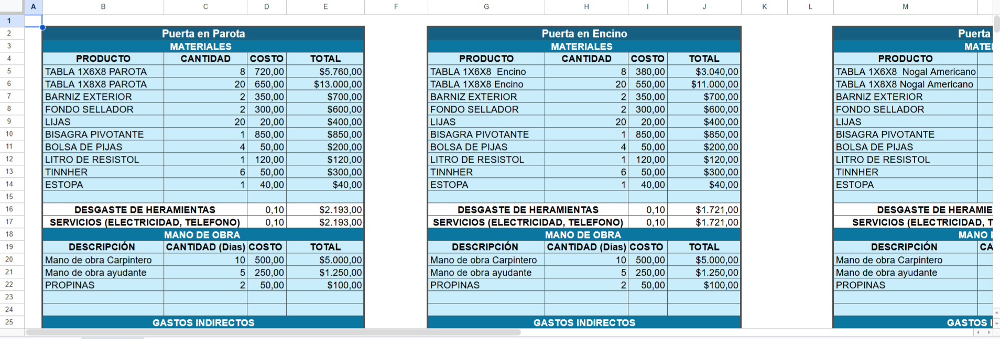

# Carpentry-Cost-Inventory-Profitability-Analysis


## Overview

This project transforms unstructured carpentry data into a structured dataset and analyzes project-level financial performance.

The analysis identifies key cost drivers, evaluates profitability across projects, and highlights client concentration risks to support better pricing and cost optimization decisions.


## Objectives

* Standardize unstructured Excel data
* Validate and analyze project costs
* Evaluate profitability across projects
* Identify high-margin and loss-making projects
* Analyze performance by product type and client


## Dataset
The dataset was built from raw Excel files with multiple sheets and inconsistent formats.



### Key Fields

#### Project Information

* PROJECT_ID, PROJECT_NAME, CLIENT, PRODUCT_TYPE

#### Operational Data

* MATERIAL, QUANTITY, DIMENSIONS
* THICKNESS, WIDTH, LENGTH, VOLUME
* CATEGORY, TYPE, GROUP_NAME

#### Financial Data

* TOTAL_COST, CALCULATED_TOTAL
* PRICE, PROFIT, MARGIN
* COST_DIFFERENCE

---

##  Process

### 1. Data Extraction & Cleaning
- Consolidated multiple Excel sheets into a single dataset  
- Handled inconsistent formats (horizontal and vertical tables)  
- Standardized column names and data types  

---

### 2. Data Transformation
- Created calculated fields:
  - `CALCULATED_TOTAL` (cost validation)
  - `COST_DIFFERENCE`
  - `VOLUME` (material estimation)  
- Ensured relational consistency using `PROJECT_ID`

---

### 3. SQL Analysis (SQLite)

A structured SQL layer was implemented for analysis:

```sql
CREATE VIEW project_analysis AS
SELECT
    PROJECT_ID,
    PROJECT_NAME,
    CLIENT,
    PRODUCT_TYPE,
    QUANTITY,
    COST_TOTAL,
    PRICE,
    PROFIT,
    MARGIN
FROM projects;
```


This view simplifies querying and enables efficient financial analysis.

---

### 4. Profitability Analysis
- Identified most and least profitable projects  
- Detected loss-making projects  
- Evaluated performance by client and product type  

---

### 5. Visualization
- Interactive dashboard developed in Power BI  
- Key metrics:
  - Revenue, Cost, Profit  
  - Margin by project  
  - Cost distribution by category  
  - Client-level performance  


##  Dashboard Preview

###  Business Overview


###  Cost Structure


## Complete Dashboard

The dashboard highlights overall profitability and identifies material costs as the primary expense driver.


##  Key Insights

- The business generated **~524K in revenue** with **~316K in costs**, resulting in **~208K profit (~40% margin)**  
- Revenue is highly concentrated in a small number of clients, indicating potential dependency risk  
- Raw materials (especially wood and finishes) represent the majority of total costs  
- Profitability varies across projects, suggesting opportunities for pricing standardization  
- High-cost projects drive revenue but also introduce higher variability in margins  

---

##  Tech Stack
- Python (Pandas, NumPy)  
- SQLite  
- Power BI  
- Excel  

---

##  Project Structure
carpentry-analysis/
│── data/
│   ├── raw/
│   └── processed/
│── notebooks/
│── dashboards/


---

##  How to Run
1. Open the notebook in Google Colab  
2. Upload the dataset (if required)  
3. Run all cells  

---

##  Future Improvements
- Automate ETL pipeline  
- Build a predictive pricing model  
- Integrate inventory tracking  
- Deploy dashboard for real-time monitoring  

---

##  License
This project is licensed under the MIT License.

---

##  Author
Héctor López


